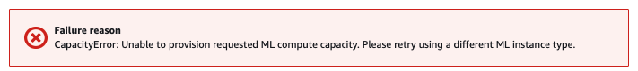

# Amazon SageMaker Distributed Training Hands-on Lab - TensorFlow 2.x

## Introduction
본 핸즈온은 TensorFlow 2.x에서 SageMaker 분산 훈련(SageMaker Distributed Data Parallel; SDP) 및 디버깅 & 프로파일링을 수행하며, AWS 공식 예제들을 보완 및 한글화하였습니다. 공식 예제에서 업데이트된 주요 내역들은 아래와 같습니다.
- Horovod 분산 훈련 코드 오류 수정
- Debugger & Profiling Report 보완
- TensorBoard Visualization 추가

### Prerequisite for Beginners (Recommended)
본 핸즈온의 레벨은 300레벨이고 사용자들이 이미 SageMaker의 기본 기능을 알고 있다고 가정합니다. 따라서, SageMaker를 처음 접해보시는 분들은 핸즈온을 수행하기 전 반드시 아래의 링크 자료들을 학습해 주세요.  
- [SageMaker 오버뷰(50분)](https://www.youtube.com/watch?v=jF2BN98KBlg)
- [SageMaker 데모(60분)](https://www.youtube.com/watch?v=miIVGlq6OUk)
- [Amazon SageMaker를 통한 딥러닝 분산 학습 및 디버거 프로파일링 활용하기(28분)](https://www.youtube.com/watch?v=lsTtoACAPj4)
- [TensorFlow 2.x BYOS(Bring Your Own Script) and BYOC(Bring Your Own Container) Hands-on Lab](https://github.com/daekeun-ml/sagemaker-byos-byoc)

### Caution 
- SageMaker Distributed Data Parallelism 핸즈온은 `ml.p3.16xlarge, ml.p3dn.24xlarge, ml.p4d.24xlarge` 인스턴스만 지원하며, 이머전데이 및 워크샵은 반드시 `ml.p3.16xlarge`로 수행하셔야 합니다. 가용 인스턴스의 부족으로 아래와 같은 에러 메세지가 계속 출력되면, 소개 자료 및 강사의 데모 시연 영상을 참조하세요. 

## Hands-on Labs
- [1. SageMaker Debugger Profiler](1.profiling)
  - 추천 조합: `low_batch_size.ipynb`, `tf-resnet-profiling-multi-gpu-multi-node.ipynb` 수행 (약 90분)
- [2. SageMaker Distributed Data Parallelism w/ Debugger Profiler - Fashion MNIST dataset](2.sdp-with-debugger-fashion-mnist)

## References
- TensorFlow Profiling: https://github.com/aws/amazon-sagemaker-examples/tree/master/sagemaker-debugger/tensorflow_profiling 
- SageMaker Distributed Data Parallelism w/ Debugger Profiler: https://github.com/aws-samples/amazon-sagemaker-dist-data-parallel-with-debugger

## License Summary
이 샘플 코드는 MIT-0 라이센스에 따라 제공됩니다. LICENSE 파일을 참조하십시오.